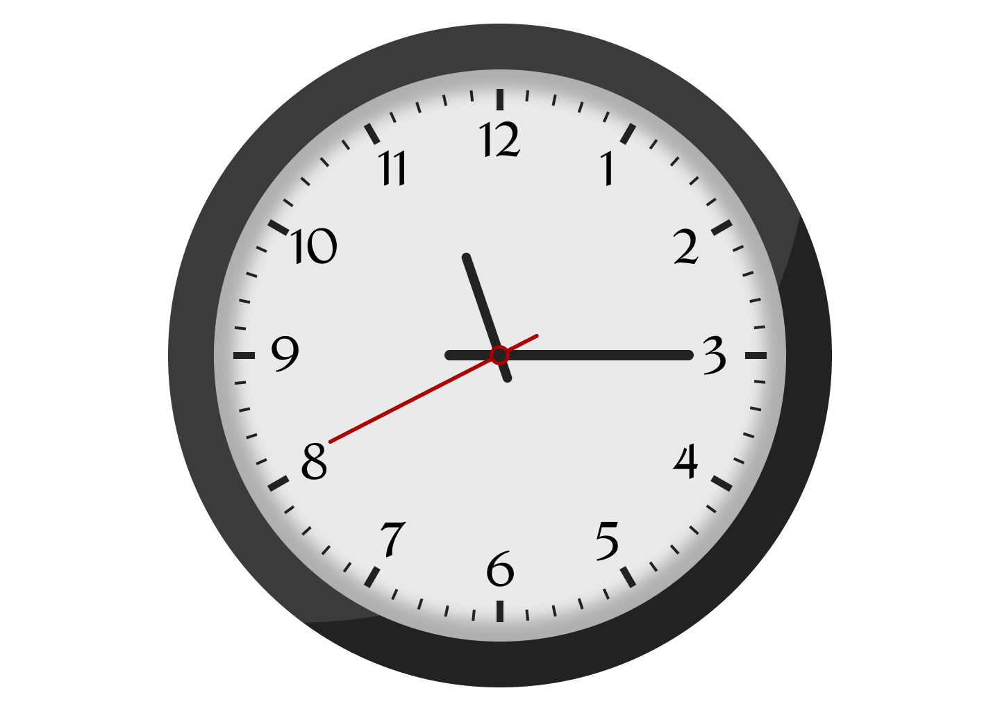

# Analog Clock ([Demo](https://softon.github.io/analog_clock))

A simple Javascript analog clock. Complete design process from figma ui design to HTML/CSS design followed by making to run using javascript code.

## Video Tutorial

- **Part 1** : UI Design in Figma ([Download .fig File](Black%20Clock.fig)) ([Link to Video](https://youtu.be/RAHopeqyXVA)) 
- **Part 2** : Figma Design to HTML/CSS ([Link to Video](https://youtu.be/_RCZW4bK6mY)) 
- **Part 3** : Make it work using Javascript ([Link to Video](https://youtu.be/-n3VDlTvViI)) 
- **Part 4 (Todo)** : Make it responsive  
- **Part 5 (Todo)** : Add alarms option  

> Check the tags for source code of various stages.